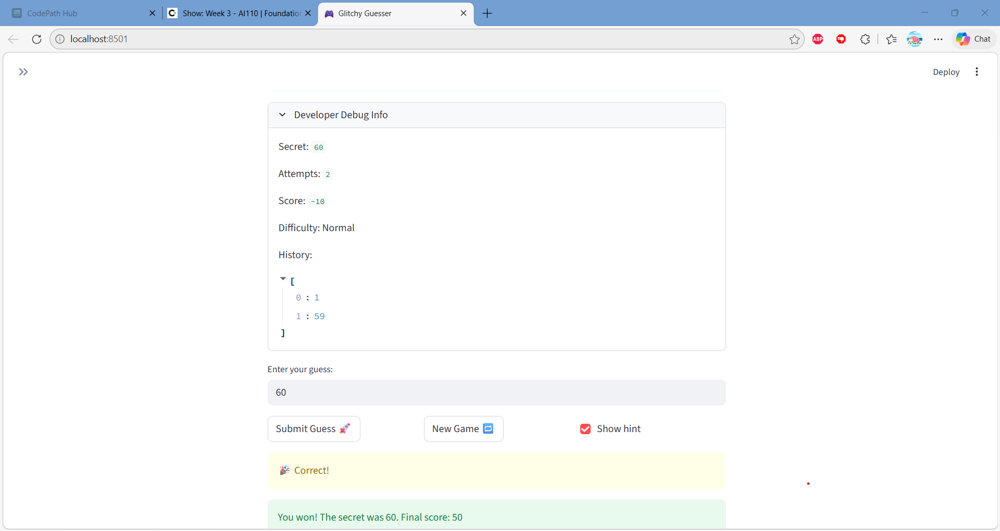

# 🎮 Game Glitch Investigator: The Impossible Guesser

## 🚨 The Situation

You asked an AI to build a simple "Number Guessing Game" using Streamlit.
It wrote the code, ran away, and now the game is unplayable. 

- You can't win.
- The hints lie to you.
- The secret number seems to have commitment issues.

## 🛠️ Setup

1. Install dependencies: `pip install -r requirements.txt`
2. Run the broken app: `python -m streamlit run app.py`

## 🕵️‍♂️ Your Mission

1. **Play the game.** Open the "Developer Debug Info" tab in the app to see the secret number. Try to win.
2. **Find the State Bug.** Why does the secret number change every time you click "Submit"? Ask ChatGPT: *"How do I keep a variable from resetting in Streamlit when I click a button?"*
3. **Fix the Logic.** The hints ("Higher/Lower") are wrong. Fix them.
4. **Refactor & Test.** - Move the logic into `logic_utils.py`.
   - Run `pytest` in your terminal.
   - Keep fixing until all tests pass!

## 📝 Document Your Experience

- [x] Describe the game's purpose.
The purpose of the game is a number guessing game where the player tries to guess a secret number between 1 and 100. The game gives hints after each guess telling you whether to go higher or lower.

- [x] Detail which bugs you found.
The first bug was that the hints were backwards — guessing too high said "Go HIGHER" and guessing too low said "Go LOWER". The second bug was that attempts started at 1 instead of 0, so players automatically lost one attempt before even guessing. The third bug was that on even attempts the secret number was converted to a string, causing wrong comparisons.

- [x] Explain what fixes you applied.
- Swapped the hint messages in `check_guess` so directions are correct
- Changed attempts to start at 0 in session state
- Removed the `str()` conversion so the secret stays as an integer
- Moved core logic into `logic_utils.py` to separate game logic from the UI

## 📸 Demo

## 🚀 Stretch Features

- [ ] [If you choose to complete Challenge 4, insert a screenshot of your Enhanced Game UI here]
